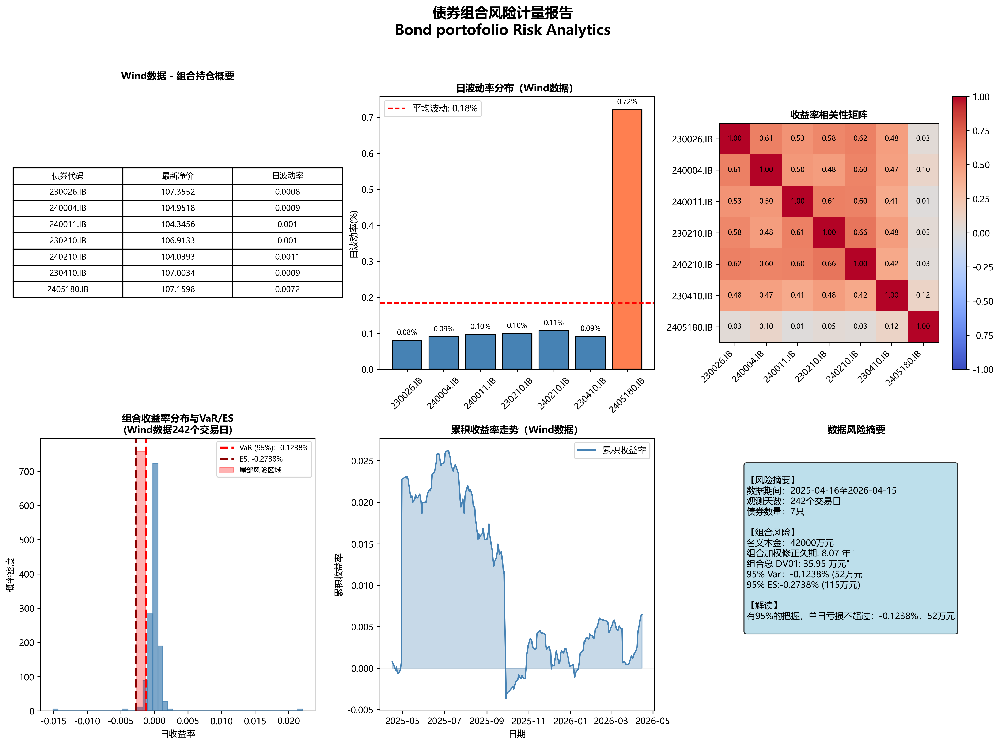

# 债券组合风险计量报告（Bond Portfolio Risk Analytics）

> 基于 FRM 理论框架，自主实现债券久期/DV01 计算，集成历史模拟法 VaR/ES，生成专业风控报告。  

## 📌 项目背景

在固定收益组合管理中，需要快速、准确地计量：
- 单券及组合的**修正久期、凸性、DV01**（利率敏感性指标）
- 组合层面的**VaR** 与**ES**
- 持仓的**波动率分布**与**收益率相关性**

本项目将现金流贴现模型和久期公式转化为可运行的 Python 代码，并集成了历史模拟法 VaR 计算，最终输出一份**可直接用于风控日报的专业图表报告**。

## ✨ 主要功能

- ✅ **久期计算**：从 YTM 和票息出发，计算麦考利久期、修正久期、凸性、DV01（不依赖外部接口）
- ✅ **组合风险汇总**：面值加权久期、总 DV01、总名义本金
- ✅ **历史模拟法 VaR**：基于 Wind 历史收盘价，计算 95% 置信水平下的 VaR 和 ES
- ✅ **可视化报告**：自动生成 2×3 六合一专业图表，包括：
  - 持仓概要表（最新价、波动率）
  - 单券日波动率柱状图
  - 收益率相关性热力图
  - 组合收益分布与 VaR/ES 尾部区域
  - 组合累积收益率走势
  - 风险摘要文本框
- ✅ **Excel 摘要导出**：关键指标汇总，便于汇报

## 🛠 技术栈

- Python 3.8+
- pandas, numpy, matplotlib, scipy
- Jupyter Notebook

## 📁 文件结构
Bond_Risk_Analytics/
├── Bond_Risk_Analytics.ipynb # 主程序（完整代码）
├── 债券组合风险报告.png # 自动生成的风险报告图
├── bond_risk_summary.xlsx # 自动生成的 Excel 摘要
├── README.md # 项目说明
└── data/ # （示例数据，不涉及敏感数据）
├── wind_bond_prices.xlsx # 历史收盘价（宽表）
└── bond_basic.xlsx # 债券基础信息（票息、YTM、到期日等）

## 🚀 快速开始

1. 下载代码

git clone https://github.com/SevenSigma7/Bond_Risk_Analytics.git
cd Bond_Risk_Analytics

2. 安装依赖
pip install pandas numpy matplotlib scipy openpyxl

3. 准备数据
将 Wind 导出的两个 Excel 文件放入 data/ 目录（或修改代码中的路径）：

wind_bond_prices.xlsx
行=日期，列=债券代码，值为每日收盘价

bond_basic.xlsx
包含字段：bond_code, face_value, coupon_rate, ytm, maturity_date, valuation_date, freq

示例数据格式见代码中的打印输出，请确保列名完全一致。

4. 运行 Notebook
jupyter notebook Bond_Risk_Analytics.ipynb

点击 Kernel → Restart & Run All 执行全部单元格。

📊 结果示例

上图为程序自动生成的六合一风险报告，包含持仓概要、波动率分布、相关性热力图、VaR/ES 尾部区域、累积收益曲线及风险摘要。

📄 输出文件
债券组合风险报告.png – 六合一专业图表，可直接用于日报

bond_risk_summary.xlsx – 风险摘要 Excel，包含：

估值日期

组合面值（万元）

加权修正久期（年）

组合 DV01（万元）

95% 日 VaR（万元）

95% ES（万元）

🔍 核心逻辑说明
1. 自主久期/DV01 计算
使用现金流贴现模型，基于 YTM 和剩余期限计算每只债券的：

修正久期 = 麦考利久期 / (1 + YTM/freq)

DV01 = 修正久期 × 价格 × 0.0001

2. 历史模拟法 VaR
用过去 242 个交易日的日收益率（Wind 收盘价）

按面值权重计算组合日收益率序列

取 5% 分位数得到 VaR，计算尾部均值得到 ES

3. 可视化自动化
使用 matplotlib 生成 2×3 子图，自动标注关键指标

热力图展示债券间相关性，便于识别风险集中度

👤 作者
GitHub: SevenSigma7

📃 许可证
本项目仅供学习交流使用，数据请使用合法授权的数据库导出。

项目完成时间：2026年5月
数据期间：2025-04-16 至 2026-04-15（242个交易日）
组合构成：7只政策性金融债，总面值 4.2 亿元
